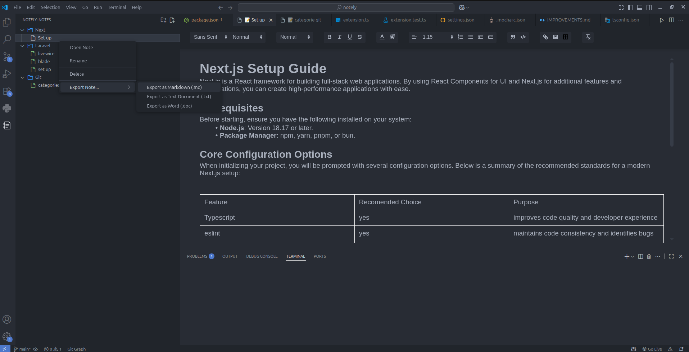

# Notely

Notely is a global note-taking companion for Visual Studio Code. Designed to eliminate context switching, Notely provides a persistent, rich-text workspace that stays accessible across all your projects. Whether you are documenting coding rules, storing frequently used snippets, or managing project requirements, Notely ensures your essential information is always visible right alongside your codebase.

---

## Core Features

- **Global Persistence:** Your notes are accessible across all VS Code projects, allowing you to reference documentation while working on different codebases simultaneously.
- **Word-like Editor:** A high-fidelity rich-text editor that simplifies formatting. Write with ease and ensure your output remains clean and structured.
- **Flexible Exporting:** Export your notes instantly to Markdown (.md), Microsoft Word (.doc), or plain text (.txt) formats to share your findings or integrate them into project repositories.
- **Hierarchical Organization:** Structure your workspace with custom folders and files, keeping your documentation environment as organized as your project files.

---

## Workspace Structure

The Notely interface provides a structured directory of folders and files. This layout facilitates seamless navigation through your documentation, allowing you to maintain a clear overview of your project requirements, logic, and notes while staying focused on your active development tasks.

---

## Getting Started

1. **Access:** Click the Notely icon on the Activity Bar.
2. **Create:** Use the sidebar menu to create folders and notes.
3. **Write:** Open any note to begin drafting with the rich-text editor.
4. **Export:** Right-click any note or folder to export your content in your preferred format.

## System Requirements

- **Visual Studio Code** version `1.103.0` or later.

## License

Distributed under the MIT License.